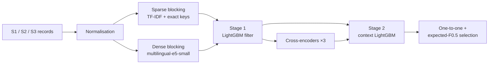

# Business Entity Resolution — Amazon ML Challenge 2026


**Team mp_up_bangal:** Mayank Mishra, Akarsh Dubey

## Overview

The task is to match business records from three noisy sources that share no identifiers. For each record in the
reference source (S1), we predict every record in sources S2 and S3 that describes the same real-world business.
The score is macro F0.5 per S1 record.

| Result | Value |
|---|---|
| Public leaderboard F0.5 | **0.98964** |
| Rank | **63** |

## Approach



1. **Normalisation:** standardise legal forms, abbreviations and addresses, and transliterate Indic scripts to Latin.
2. **Blocking:** combine character 3-gram TF-IDF top-k search (in both directions), exact keys, and a fine-tuned
   multilingual-e5-small kNN search.
3. **Stage 1:** a LightGBM model scores pairs on name, address and number features and keeps 5.06 candidates per
   S1.
4. **Cross-encoders:** xlm-roberta-large, mdeberta-v3-base and bge-reranker-v2-m3, each fine-tuned on training
   states that the LightGBM models never see.
5. **Stage 2:** a LightGBM model with context features: ranks within each S1, competition between S1 records for
   the same candidate, sibling agreement, and the cross-encoder scores.
6. **Decision:** each S2/S3 record is assigned to at most one S1, then a match set is chosen per S1 by maximising
   expected F0.5.
7. **France:** this country appears only in the test data. The cross-encoders are further fine-tuned on synthetic
   French pairs, made by rewriting labelled US pairs into French forms.

Full details: [docs/02_methodology.md](docs/02_methodology.md).

## Repository structure

```
├── docs/
│   ├── 01_problem_statement.md   task, data, metric, rules
│   ├── 02_methodology.md         pipeline, features, models
│   ├── 03_results.md             scores and error analysis
│   ├── REPRODUCE.md              run instructions
│   └── solution_document.md      methodology document (competition template)
├── src/
│   ├── prep.py, text.py, translit.py                normalisation
│   ├── blocking.py, dense_block.py, v5_merge.py     candidate generation
│   ├── features.py, pipeline.py                     features, stage 1
│   ├── cross_encoder.py, ce_rest.py                 cross-encoders
│   ├── context.py, edit_features.py, stage2.py      stage 2
│   ├── decide.py, metric.py                         decision rule, F0.5 metric
│   ├── france_aug/                                  France step
│   ├── hybrid.py, country_check.py                  output assembly, checks
│   ├── scripts/                                     SLURM job scripts (entry: launch.sh)
│   └── models/                                      model metadata (features, thresholds)
└── requirements.txt
```

## Quick start

```bash
pip install -r requirements.txt
```

The competition data is not included. To run the pipeline, see [docs/REPRODUCE.md](docs/REPRODUCE.md). A GPU is
needed for the dense encoder and the cross-encoders (we used a V100 32 GB).

## Compliance

The solution uses no external data, APIs or lookups. All models are MIT or Apache-2.0 licensed and under 8B
parameters: LightGBM, multilingual-e5-small, mdeberta-v3-base, xlm-roberta-large (MIT) and bge-reranker-v2-m3
(Apache-2.0).
